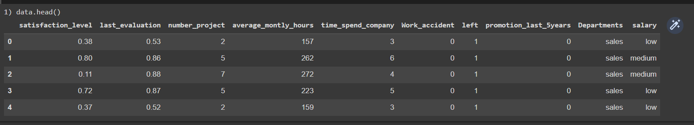
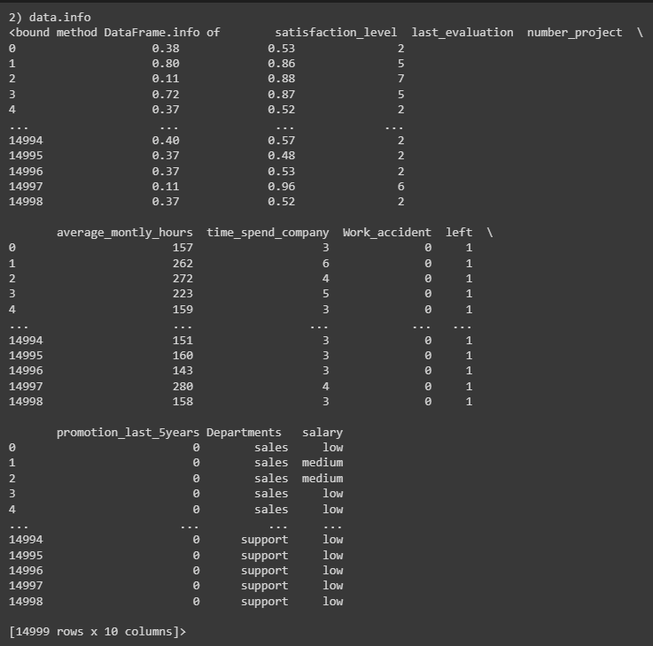
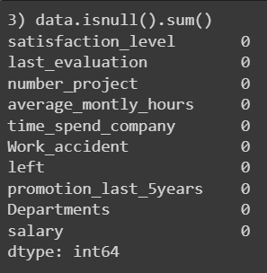
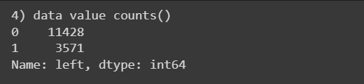
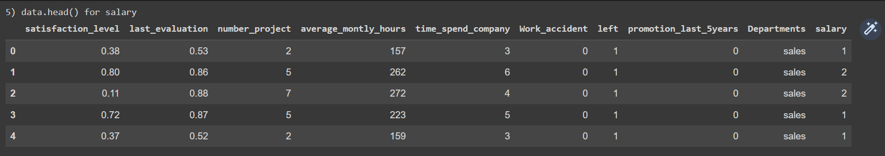
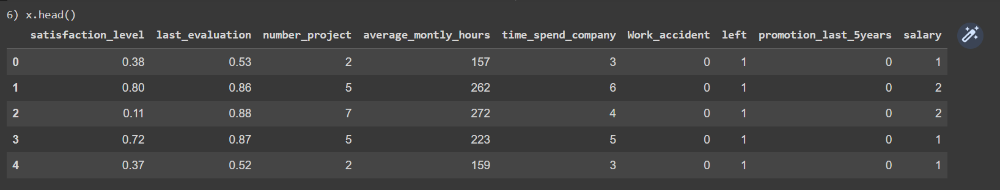
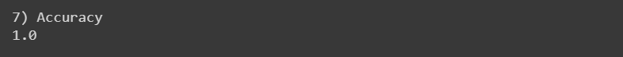
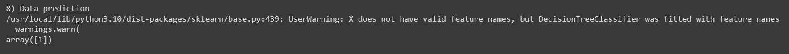

# Implementation-of-Decision-Tree-Classifier-Model-for-Predicting-Employee-Churn

## AIM:
To write a program to implement the Decision Tree Classifier Model for Predicting Employee Churn.

## Equipments Required:
1. Hardware – PCs
2. Anaconda – Python 3.7 Installation / Jupyter notebook

## Algorithm
1. Import dataset and print the dataset info
2. check for null value
3. Map numerical for salary feature
4. Asiign x and y values
5. Split as train data and test data
6. Import decision tree classifier and fit it in the dataset
7. Find accuracy and predict the values


## Program:
```
/*
Program to implement the Decision Tree Classifier Model for Predicting Employee Churn.
Developed by: 212220040020
RegisterNumber:  Aswathi S
*/

import pandas as pd
data=pd.read_csv('/content/Employee.csv')
print('1) data.head()')
data.head()
print('2) data.info')
data.info
print('3) data.isnull().sum()')
data.isnull().sum()
print('4) data value counts()')
data["left"].value_counts()
print('5) data.head() for salary')
from sklearn.preprocessing import LabelEncoder
le=LabelEncoder()
data["salary"]=le.fit_transform(data["salary"])
data.head()
print('6) x.head()')
x=data[["satisfaction_level","last_evaluation","number_project","average_montly_hours","time_spend_company","Work_accident","left","promotion_last_5years","salary"]]
x.head()
y=data["left"]
from sklearn.model_selection import train_test_split
x_train,x_test,y_train,y_test=train_test_split(x,y,test_size=0.2,random_state=10)
from sklearn.tree import DecisionTreeClassifier
dt=DecisionTreeClassifier(criterion="entropy")
dt.fit(x_train,y_train)
y_pred=dt.predict(x_test)
print('7) Accuracy')
from sklearn import metrics
accuracy=metrics.accuracy_score(y_test,y_pred)
accuracy
print('8) Data prediction')
dt.predict([[0.5,0.8,9,260,6,0,1,2,3]])
```

## Output:










## Result:
Thus the program to implement the  Decision Tree Classifier Model for Predicting Employee Churn is written and verified using python programming.